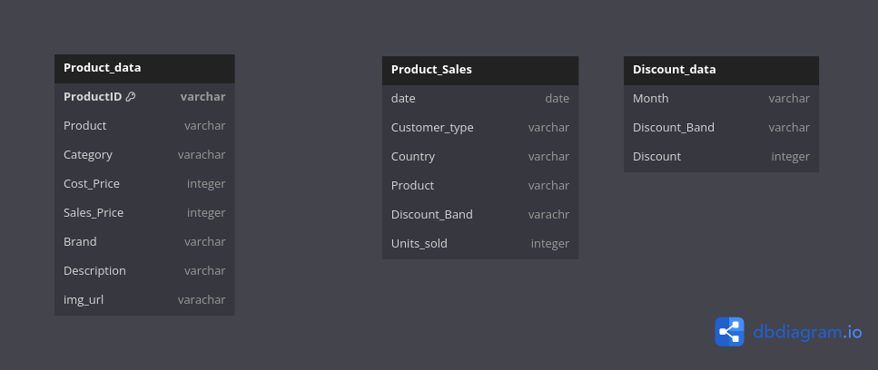

## Sql Data Analysis with Power Bi Visuaiztion

the aim of this project is to preform analysis using sql server with jupyter notebook
by using sql connector and create queries after that we will export those queries into 
power Bi to make an interactive visualization 

## project overveiw

## Data structure overveiw

